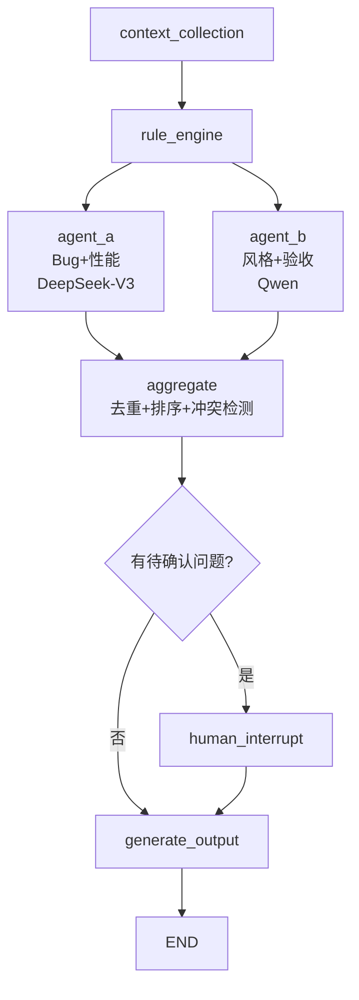

# CodeFalcon 上下文快照

> 🤖 **给 AI 助手看的文件** —— 切换到本工作空间时，先读这个文件即可瞬间对齐颗粒度。
> 
> 📅 最后更新：2026-06-20
> 📍 项目版本：v0.1.0 (MVP完成，P2扩展中)

---

## 一、这是什么项目？

**CodeFalcon**（猎鹰代码审查）—— 面向 Vibe Coding 时代的多 Agent 协作智能代码审查系统。

核心要解决的问题：AI 生成的代码越来越多，开发者需要自动化的"代码安全网"来判断 AI 写的代码是否可靠。

### 一句话定位

> 猎鹰般精准的多 Agent 代码审查系统 —— 规则引擎 + 并行 Agent + 汇总仲裁 + 人机回环

---

## 二、当前进度

| 模块 | 状态 | 说明 |
|------|------|------|
| `src/orchestrator/` | ✅ 完成 | 10节点DAG、状态流转、条件路由、Agent并行化 |
| `src/agents/` | ✅ 实现完成 | Agent A(DeepSeek-V3) + Agent B(Qwen)，LLM全接入 |
| `src/rules/` | ✅ 实现完成 | SecurityRuleEngine(8规则) + StyleRuleEngine(2规则) |
| `src/tools/` | ✅ 完成 | ASTAnalyzer、CodeSearch、DepAnalyzer，已接入上下文 |
| `src/context/` | ✅ 完成 | Collector + Indexer，依赖分析结果注入Agent提示词 |
| `src/review/` | ✅ 实现完成 | Aggregator(去重+排序+冲突检测) + Prioritizer |
| `src/output/` | ✅ 实现完成 | Reporter(按日期分文件夹+5次压缩) + TodoManager(全局序号+日期) |
| `src/utils/` | ✅ 完成 | Config、CostTracker(全局单例)、Logger |
| `src/main.py` | ✅ CLI完成 | `review`/`status`/`done` 三命令全实现 |
| `tests/` | ✅ **30/30 全部通过** | 安全8 + 风格7 + AST5 + 仲裁4 + 集成6 |

---

## 三、测试清单（17个 🟢 全部通过）

### test_rules.py — 8个
1. `test_detect_hardcoded_api_key` — 检测 `sk-xxx` 格式密钥
2. `test_detect_hardcoded_password` — 检测 `password = "xxx"`
3. `test_detect_sql_injection_format` — 检测 `%s` 格式化SQL
4. `test_detect_sql_injection_fstring` — 检测 f-string SQL
5. `test_detect_command_injection_os_system` — 检测 `os.system()` 拼接
6. `test_detect_eval` — 检测 `eval()` 调用
7. `test_clean_code_no_findings` — 干净代码返回0发现
8. `test_multiple_files` — 多文件扫描

### test_tools.py — 5个
1. `test_extract_function_definitions` — AST提取函数定义
2. `test_extract_class_definitions` — AST提取类定义+方法
3. `test_build_call_graph` — 构建调用关系图
4. `test_empty_code` — 空代码边界
5. `test_syntax_error_handling` — 语法错误容错

### test_review.py — 4个
1. `test_deduplicate_same_line` — 同行去重取最高严重度
2. `test_priority_sorting` — 优先级排序(security>style, error>info)
3. `test_empty_findings` — 空发现边界
4. `test_conflict_detection` — Agent间冲突产生 pending_questions

---

## 四、架构关键决策

### 为什么用 LangGraph 而不是 CrewAI/AutoGen？

CodeFalcon 是**多阶段流水线**，不是自由对话：
- 明确的状态流转（State Schema）
- 条件路由（遇复杂问题→人机回环）
- 并行节点（规则引擎后 Agent A/B 同时跑）
- 内置 Human-in-the-loop（interrupt 机制）

### Agent 通信模式：交接文档（Handover Document）

Agent A 和 Agent B 不直接通信。A 完成后在 state 中写入"给 B 的交接文档"，B 启动时读取。解耦，各自可替换。

### 三级成本控制路由

| 层级 | 用什么 | 成本 | 场景 |
|------|--------|------|------|
| L1 规则引擎 | 正则/AST | $0 | 硬编码密钥、SQL注入、尾随空格 |
| L2 廉价模型 | Qwen-Turbo | ~$0.00005/1K tokens | 命名规范、基础风格 |
| L3 标准模型 | DeepSeek-V3 | ~$0.00014/1K tokens | 跨文件逻辑Bug、性能设计 |

### 技术栈速查

```
LangGraph (编排) + LangChain (LLM抽象)
Click (CLI) + Pydantic (数据模型) + python-dotenv (配置)
Python AST (代码分析) + pytest (测试)
```

---

## 五、DAG 流程（8个节点）



---

## 六、目录速查

```
codefalcon/
├── src/
│   ├── main.py                  ← CLI入口（codefalcon review/status/done）
│   ├── orchestrator/
│   │   ├── state.py             ← ReviewState + Finding 数据模型
│   │   ├── graph.py             ← StateGraph定义(8节点DAG)
│   │   └── router.py            ← 三级模型路由
│   ├── agents/
│   │   ├── base.py              ← Agent基类
│   │   ├── bug_perf_agent.py    ← Agent A
│   │   └── style_accept_agent.py ← Agent B
│   ├── rules/
│   │   ├── security.py          ← 安全规则引擎(已实现)
│   │   └── style.py             ← 风格规则引擎(骨架)
│   ├── tools/
│   │   ├── code_search.py       ← 代码搜索
│   │   ├── ast_analyzer.py      ← AST分析(已实现)
│   │   └── dep_analyzer.py      ← 依赖分析
│   ├── context/
│   │   ├── collector.py         ← 上下文收集
│   │   └── indexer.py           ← 代码索引
│   ├── review/
│   │   ├── aggregator.py        ← 汇总仲裁(已实现)
│   │   └── prioritizer.py       ← 优先级排序
│   ├── output/
│   │   ├── reporter.py          ← 报告生成
│   │   └── todo_manager.py      ← 待办管理
│   └── utils/
│       ├── config.py            ← 配置管理
│       ├── cost_tracker.py      ← Token成本追踪
│       └── logger.py            ← 日志
├── tests/
│   ├── test_rules.py            ← 安全规则测试(8/8通过)
│   ├── test_tools.py            ← AST分析器测试(5/5通过)
│   ├── test_review.py           ← 汇总仲裁器测试(4/4通过)
│   └── fixtures/
│       ├── sample_buggy.py      ← 有Bug测试样本
│       └── sample_clean.py      ← 干净代码测试样本
├── reviews/                     ← 审查报告输出目录
├── CONTEXT.md                   ← 📍 你正在读的文件
├── ARCHITECTURE.md              ← 详细架构设计文档
├── README.md                    ← 项目README
├── pyproject.toml               ← 项目配置+CLI入口注册
├── requirements.txt             ← Python依赖
├── Dockerfile                   ← Docker部署
└── .env.example                 ← 环境变量模板(DEEPSEEK/QWEN API Key)
```

---

## 七、待办清单（按优先级）

### 🔴 P0 — 核心流程打通 ✅ 已完成
- [x] 实现 Agent A `review()` 方法——接 DeepSeek API
- [x] 实现 Agent B `review()` 方法——接 Qwen API
- [x] 实现 `review` 命令完整流水线（10节点DAG）
- [x] 端到端测试通过 + Agent A/B 并行化

### 🟡 P1 — 完善输出层 ✅ 已完成
- [x] JSON + Markdown 双格式报告，按日期分文件夹
- [x] TODOS.md 全局序号 + 日期标注 + pending/done 分区
- [x] CLI `review`/`status`/`done` 三命令全实现
- [x] 每5次审查自动压缩归档

### 🟢 P2 — 扩展能力 ✅ 已完成
- [x] 风格规则引擎（行长度、尾随空格），接入DAG
- [x] CodeSearch + DepAnalyzer 工具接入Agent上下文
- [x] Token 成本统计（全局单例 + CLI显示 + 报告嵌入）
- [x] 集成测试 6个（含mock流水线、CLI命令）

### 🔵 P3 — 工程化
- [x] Dockerfile 完善 + .dockerignore
- [ ] CI/CD pipeline 配置
- [ ] 生产级性能测试与优化
- [ ] Web UI 或 IDE 插件

---

## 八、快速启动命令

```bash
cd /Users/macbook/CodeBuddy/codefalcon

# 安装依赖
pip install -r requirements.txt

# 配置API Key
cp .env.example .env
# 编辑 .env 填入 DEEPSEEK_API_KEY 和 QWEN_API_KEY

# 运行测试
python -m pytest tests/ -v

# CLI使用
python -m src.main review ./tests/fixtures/sample_buggy.py
```
```


